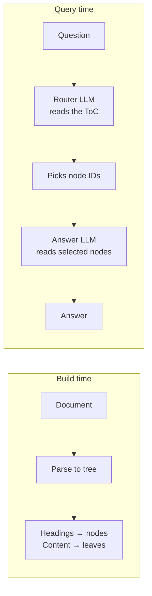

# Vectorless RAG at FarmwiseAI

> Why I moved off embeddings and onto a tree-walking retriever — and how it works in production today.

## What I built
A retrieval pipeline for our internal documents that doesn't use embeddings or a vector database. An LLM reads a tree-of-contents of the document, picks which nodes look relevant, and a second LLM call answers using just those nodes. Two calls per question. Nothing to maintain between them.

## The decision that mattered
The first version was the standard playbook — Qdrant for the vector store, bge-large for embeddings, cosine similarity for retrieval. It ran fine. But the answers were often wrong. The retriever was pulling text that *looked like* the question rather than text that *answered* it. On long structured documents — policies, runbooks, product specs — that gap matters a lot.

I came across the PageIndex approach (an LLM reasoning over a tree of headings instead of similarity over flat chunks), built a version on top of the same document set, and answer quality went up immediately. We've stayed on it since.

The honest trade-off: two LLM calls per query costs more latency and more tokens than one embedding lookup plus one generation. For internal documents where being correct matters more than being instant, that's the right side of the trade.

## How it works

## How I built it
I work as an agent orchestrator. I do the design, the planning, the constraints, the production rules; Claude Code and Cursor do the actual coding. I keep project files that pin down what's allowed, what isn't, and which workflow applies — TDD for things that need it, code-then-test where that's enough — so the model stays inside the lines and I stay focused on the parts that actually need judgement.

For this project, the migration off Qdrant was the kind of work where a clear spec pays off. I wrote out the new flow and validated retrieval against real questions; the model handled most of the implementation.

## Try it
The chatbot on this site uses the same approach over a markdown knowledge base of my own work. Ask it something and look at the reasoning panel under the answer — you can see the exact nodes the model routed through to get there.
