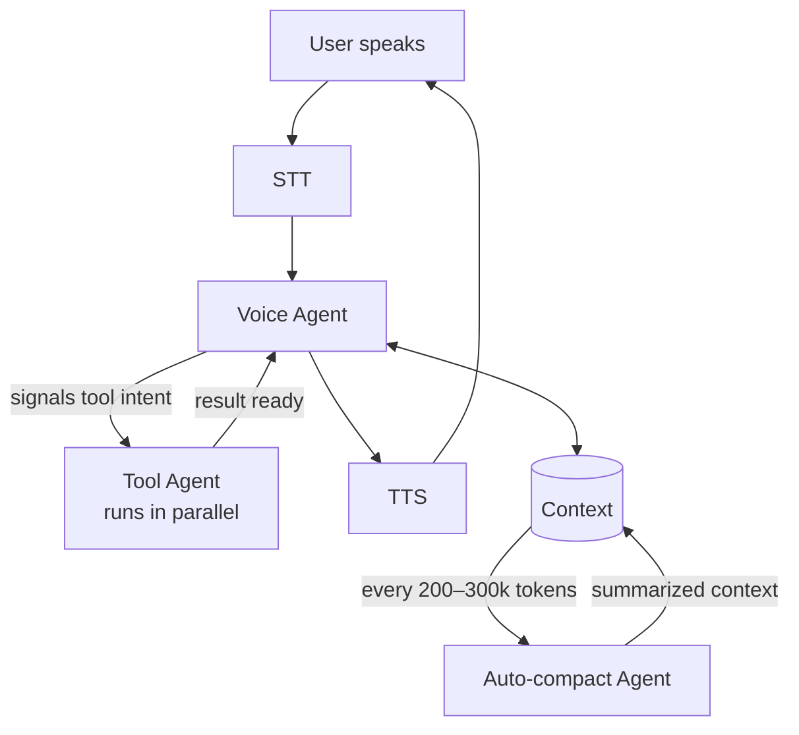

# Production voice agents at FarmwiseAI

> Two real problems we hit putting voice agents in front of users, and the two-agent architecture that solved them.

## What I built
Voice agents that hold up in production — STT → LLM → TTS loops that don't break under interruptions, partial transcripts, latency spikes, or tool calls that take time to return. The individual models aren't the hard part; the orchestration is.

## The two problems that mattered

**Context bloat.** Conversations accumulate. Once the running context crosses a couple hundred thousand tokens, latency and cost both climb and the model starts to drift. The fix was an *auto-compact agent* that runs every 200k–300k tokens — it summarizes the conversation down to what's actually needed for continuity, then hands the compressed version back to the voice agent's context. The voice agent never sees the bloat.

**Tool-call latency.** When the voice agent needs to look something up — a RAG call, a resource lookup, anything that takes a real round-trip — the user hears a pause. The fix was a *parallel tool-calling agent* that lives alongside the main one. The voice agent signals its intent to call a tool before it starts speaking; the second agent runs the tool in parallel while the voice agent is still talking. By the time the result is needed, it's already there. The user just hears a fluent response.

## How the two agents sit together

## How I built it
I work as an agent orchestrator. I do the design, the planning, the constraints, the production rules; Claude Code and Cursor do the actual coding. For voice work, the design is the bulk of the job — state machines, latency budgets per hop, what happens when STT returns junk, what happens when the user interrupts mid-response. Get that right on paper first, and the implementation is straightforward.

## Why this matters
Voice is less forgiving than chat. Users can't see or edit what they're sending; they hear pauses; they get frustrated faster. The reliability work above isn't glamorous, but it's the difference between a voice agent that demos well and one you can leave in front of real users.
